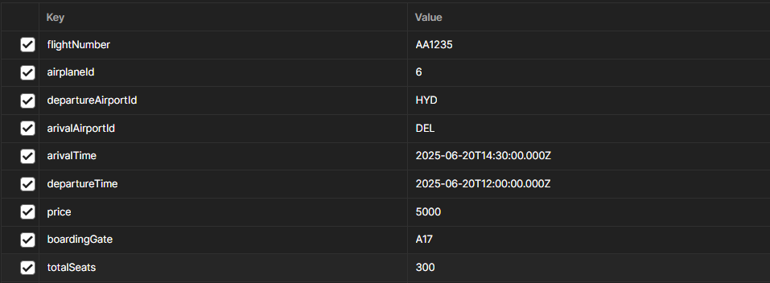
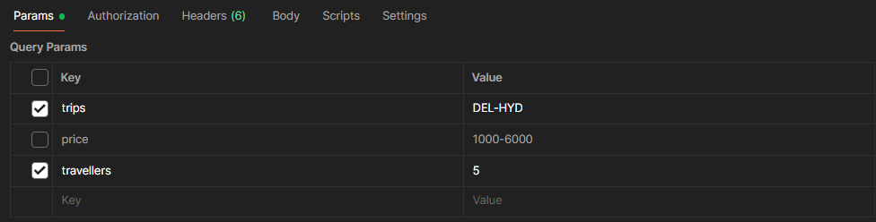

# 📦 Node.js Project with Jest + ES Modules

This project demonstrates how to set up **Jest** for testing a **Node.js** application that uses **ES Modules (ESM)**.

> 📖 Reference: [How to set up Jest for ES Module](https://how-to.dev/how-to-set-up-jest-for-es-module)

---
# API Endpoints

## Airplanes

### Create Airplane

* **POST** `localhost:8000/api/v1/airplanes`
* Request Body: Airplane data (e.g. `{ name: 'Boeing 737', capacity: 200 }`)
* Response: Created Airplane object

### Get All Airplanes

* **GET** `localhost:8000/api/v1/airplanes`
* Response: Array of all Airplane objects

### Get Airplane by ID

* **GET** `localhost:8000/api/v1/airplanes/:id`
* Path Parameter: `id` (e.g. `123`)
* Response: Airplane object with matching `id`

### Delete Airplane by ID

* **DELETE** `localhost:8000/api/v1/airplanes/:id`
* Path Parameter: `id` (e.g. `123`)
* Response: Success message (e.g. `{ message: 'Airplane deleted successfully' }`)

## Airports

### Create Airport

* **POST** `localhost:8000/api/v1/airports`
* Request Body: Airplane data (e.g. `{ name: 'Indira Gandhi International Airport',
 code: 'DEL', address:'Palam, Delhi, India',cityId:3 }`)
* Response: Created Airport object

### Get All Airports

* **GET** `localhost:8000/api/v1/airports`
* Response: Array of all Airport objects

### Get Airport by ID

* **GET** `localhost:8000/api/v1/airports/:id`
* Path Parameter: `id` (e.g. `123`)
* Response: Airport object with matching `id`

### Delete Airport by ID

* **DELETE** `localhost:8000/api/v1/airports/:id`
* Path Parameter: `id` (e.g. `123`)
* Response: Success message (e.g. `{ message: 'Airport deleted successfully' }`)

## Flights

### Create Flight

* **POST** `localhost:8000/api/v1/flights`
* Request Body: Flight data should be like that : 
 
* Response: Created Flight object

### Search Flight

* **GET** `localhost:8000/api/v1/flights`
* Params : Flight params should be like that : 
 
* Response: Get all flight  
 ```
{
    "success": true,
    "message": "Successfully get all flight",
    "data": [
        {
            "id": 1,
            "flightNumber": "AA1234",
            "airplaneId": 4,
            "departureAirportId": "DEL",
            "arivalAirportId": "HYD",
            "arivalTime": "2025-06-20T14:30:00.000Z",
            "departureTime": "2025-06-20T12:00:00.000Z",
            "price": 5000,
            "boardingGate": "A17",
            "totalSeats": 300,
            "Airplane_Detail": {
                "id": 4,
                "modelNumber": "indigo 450",
                "capacity": 500
            },
            "DepartureAirport": {
                "id": 3,
                "name": "Indira Gandhi International Airport",
                "code": "DEL",
                "address": "Palam, Delhi, India",
                "cityId": 3,
                "City": {
                    "id": 3,
                    "name": "Delhi"
                }
            },
            "ArrivalAirport": {
                "id": 4,
                "name": "Rajiv Gandhi International Airport",
                "code": "HYD",
                "address": "Shamshabad, Hyderabad, Telangana, India",
                "cityId": 4,
                "City": {
                    "id": 4,
                    "name": "Hyderabad"
                }
            }
        }
    ],
    "error": {}
}`)
 ```